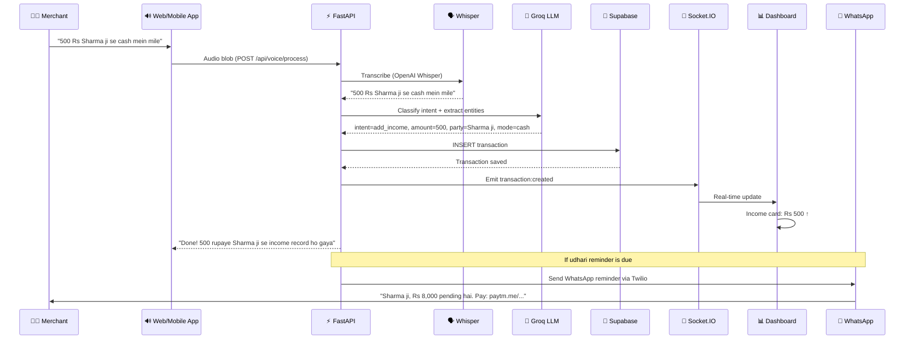

<p align="center">
  
</p>

<h1 align="center">Vyapaar GrowthOS - Agentic AI Operating System for Indian SMBs</h1>

<p align="center">
  <strong>Voice-first financial intelligence in Hindi. Manage sales, udhari, inventory, and unlock micro-loans — just speak.</strong>
</p>

<p align="center">
  
  
  
  
  
  
  
  
  
  
  
  
</p>

<p align="center">
  <a href="#the-brief">The Brief</a> •
  <a href="#features">Features</a> •
  <a href="#architecture">Architecture</a> •
  <a href="#getting-started">Getting Started</a> •
  <a href="#tech-stack">Tech Stack</a>
</p>

---

## 🚀 The Brief
**Vyapaar GrowthOS** is a multi-modal, Agentic AI Operating System designed specifically for the millions of Indian SMBs (kirana stores, local merchants). Moving beyond traditional "dumb" ledgers, GrowthOS acts as a proactive digital CFO. By leveraging autonomous AI agents, it eliminates manual data entry, automatically recovers pending *Udhari* (credit) via WhatsApp, generates dynamic credit ratings to unlock bank loans, and literally talks to the merchant in local dialects. It transforms passive bookkeeping into actionable, intelligent business growth.

---

## ✨ Features & Real-World Impact

### 🎤 Vyapaar AI Voice Assistant (Talk to your shop)
Merchants don't have time to navigate complex UI menus while managing customers. They can simply tap a button and speak in Hinglish ("Aaj ki total sale kitni hui?" or "Ramesh ko 500 rupay udhari likh do"). The AI instantly understands and acts, making the software completely frictionless.

### 📋 Smart Udhari Recovery (Never lose money to bad debt)
Asking customers for pending money is awkward. The AI autonomously tracks pending *Khata* (ledgers) and sends personalized, polite WhatsApp nudges to customers on the merchant's behalf, drastically improving cash recovery rates via Twilio Webhooks.

### 💳 Dynamic PayScore (Unlocking loans for the unbanked)
Many SMBs lack formal credit histories. GrowthOS analyzes daily cash flow velocity and Udhari recovery rates to generate a real-time "PayScore"—acting like a CIBIL score for daily operations to help merchants secure micro-loans.

### 📷 Instant Invoice Digitization (Zero manual data entry)
At closing time, merchants usually spend hours manually typing bills. Now, they just point their camera at any crumpled, handwritten, or multi-lingual invoice. **Gemini 3.8 Flash Vision APIs** instantly extract line items, totals, and log the vendor details perfectly.

### 📱 App-Less WhatsApp OS (Manage business where you chat)
Store staff don't need to download a new app. They can update inventory, log sales, or ask questions entirely through a WhatsApp bot, ensuring 100% adoption among non-tech-savvy workers.

### 🧠 AI Business Missions (A proactive consultant for your shop)
Instead of just showing confusing graphs, the AI tells the merchant exactly *what to do today*. It generates daily "Missions" (e.g., "Stock up on Parle-G for the weekend" or "Offer a discount to top 5 inactive customers") to actively drive revenue.

### 🔮 What-If Business Simulator & Cash Flow Forecast
The AI analyzes past trends and upcoming vendor payouts to warn the merchant days in advance if they might face a cash crunch. The **What-If Simulator** allows merchants to test major decisions safely (e.g., "What if I give a 10% discount on Udhari today?") and instantly see the predicted cash-flow impact.

### 📊 Smart Business Memory & Impact Tracking
The AI utilizes **LangChain** and vector embeddings to remember past conversations, customer habits, and inventory cycles. If a merchant asks "What should I order today?", the AI answers using the exact context of their unique shop history, while visually tracking how much extra revenue its decisions generated.

---

## 🏗️ Key Innovations & Technical Architecture

1.  **Agentic AI Orchestration:** Instead of a reactive LLM wrapper, we implemented an autonomous agentic loop. Background workers continuously analyze database events to proactively generate business insights without user prompting.
2.  **App-Less Twilio Routing:** Built robust NLP routers connected to Twilio Webhooks, translating unstructured natural language WhatsApp messages into strict SQL database mutations.
3.  **Multi-Modal Vernacular Pipeline:** A highly optimized pipeline chaining **Whisper-Large-v3** (STT) -> **Groq Qwen-27B** (High-speed inference) -> **Sarvam AI** (Indic TTS) for sub-second, conversational voice interactions in local Indian dialects.
4.  **Zero-Template Vision Parsing:** Discarded brittle traditional OCR in favor of **Gemini 3.8 Flash Vision APIs**. It handles unstructured, noisy, and handwritten invoices via few-shot prompting, outputting strict JSON schemas directly to the database.
5.  **Algorithmic PayScore Engine:** Moving beyond simple revenue totals, our proprietary algorithm uses weighted moving averages and historical behavioral data to calculate real-time creditworthiness.
6.  **Edge-Ready WebSockets:** Implemented `python-socketio` over ASGI in FastAPI for ultra-low latency bi-directional streaming, ensuring the Voice AI feels exactly like a seamless human phone call.
7.  **Modular Mobile-First Simulation:** Built a responsive Next.js/Turborepo architecture utilizing strict CSS containment and Framer Motion to simulate a native app experience entirely within a desktop browser window.

---

## ⚙️ Architecture Data Flow



---

## 🛠️ Tech Stack

### Frontend
| Technology | Purpose |
|-----------|---------|
| **Next.js 16** | React framework with Turbopack |
| **TypeScript** | Type-safe development |
| **Tailwind CSS v4** | Utility-first styling |
| **Framer Motion** | Animations and transitions |
| **Socket.IO Client** | Real-time WebSocket updates |

### Backend
| Technology | Purpose |
|-----------|---------|
| **FastAPI** | Python async API framework |
| **Groq LLM** | Qwen 27B / Llama 3.3 for NLU + chat |
| **OpenAI Whisper** | Speech-to-text (Hindi) |
| **Gemini 3.8 Flash** | Vision API for unstructured OCR |
| **Supabase** | PostgreSQL database + auth |
| **Socket.IO** | Real-time event emission |
| **Twilio** | WhatsApp + SMS + Voice calls |
| **Sarvam AI** | Hindi text-to-speech (Bulbul TTS) |
| **LangChain** | Agentic loop orchestration and RAG |

---

## 🚀 Getting Started

### Prerequisites

- Node.js 18+
- Python 3.12+
- Supabase account
- API keys: Groq, Gemini, Twilio, Sarvam

### 1. Clone and Install

```bash
git clone https://github.com/Saloni3494/vyapaar-growthos.git
cd vyapaar-growthos

# Frontend
cd apps/web
npm install

# Backend
cd ../../services/ai-engine
pip install -r requirements.txt
```

### 2. Environment Setup

Create `services/ai-engine/.env`:

```env
# Required
GROQ_API_KEY=your_groq_key
GEMINI_API_KEY=your_gemini_key
SUPABASE_URL=your_supabase_url
SUPABASE_KEY=your_supabase_key

# Optional (for full features)
TWILIO_ACCOUNT_SID=your_twilio_sid
TWILIO_AUTH_TOKEN=your_twilio_token
TWILIO_WHATSAPP_NUMBER=whatsapp:+14155238886
SARVAM_API_KEY=your_sarvam_key
```

### 3. Start Development

```bash
# Terminal 1: Backend
cd services/ai-engine
uvicorn main:socket_app --host 0.0.0.0 --port 8000

# Terminal 2: Frontend
cd apps/web
npm run dev
```

### 4. Access

- **Landing Page**: http://localhost:3000
- **Dashboard**: http://localhost:3000/dashboard
- **Mobile Simulation**: http://localhost:3000/mobile-simulation

---

## 📄 License

MIT

---

<p align="center">
  
  <br/>
  <strong>Built with AI for Bharat</strong>
  <br/>
  <sub>Your digital muneem that never sleeps.</sub>
</p>
